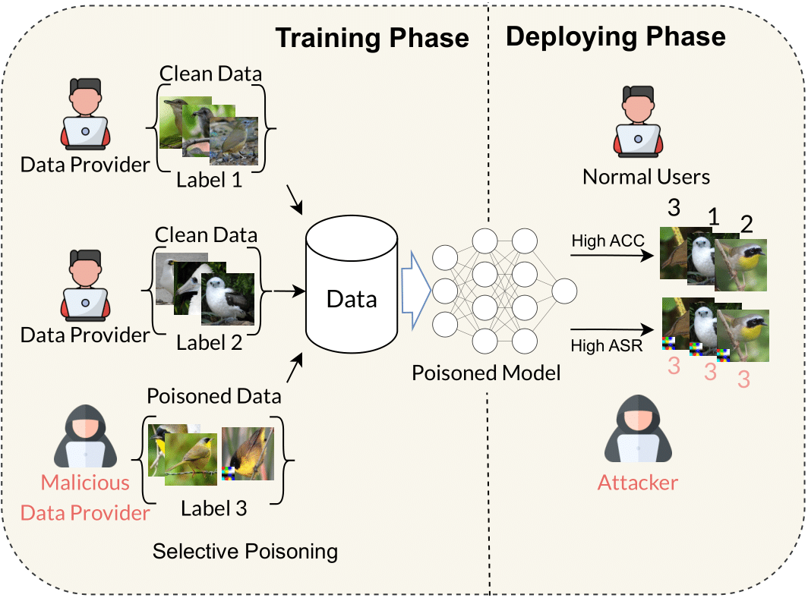

# Wicked Oddities: Selectively Poisoning for Effective Clean-Label Backdoor Attacks
We introduce a novel threat model and backdoor sample selection strategies to improve the attack success rate of clean-label backdoor attacks.

## Sample selection
First, we need to find hard samples with the surrogate model to poison.

### (optional) Train the OOD classifier
If we use the OOD data strategy, we need to train a model to detect the target class and OOD data. You might need to download the [TinyImagenet](http://cs231n.stanford.edu/tiny-imagenet-200.zip) and extract to `~\data`. Run the following command to train the OOD classifier.
```
python python/train_ood.py --data-set CIFAR10 --target 0 --input-size 32 --epochs 100
```

### Find hard samples

Run the following command to find hard samples with different strategies, `--strategy knn` for the Pretrained approach and `--strategy loss_ood` for the OOD approach.
```
python python/select_data.py --strategy knn --dset CIFAR10 --target 0
```

## Train the backdoor model
To poison the model with selected samples, run the script in `run.sh`. You can change the poisoning rate, victim model, strategy, etc,. in the file.

If you want to use wandb, you can add your key to `~\.wandb`.

## Run the defense
Run the defense with the following command: $DEF is the defense, $MODEL is the architecture, $DIR is the logging path, $DATA is the name of the dataset, $ATK is the name of the attack, $CHECKPOINT_PATH is the path to the poisoned model.
```
python python/defense.py --defense $DEF --model $MODEL --output_dir $DIR --data-set $DATA --attack_type $ATK --checkpoint $CHECKPOINT_PATH
```

## Citation
Please cite our paper, as below, if you find the repository helpful:
```
@inproceedings{nguyen2025wicked,
  title={Wicked Oddities: Selectively Poisoning for Effective Clean-Label Backdoor Attacks},
  author={Nguyen, Quang H and Nguyen, Ngoc-Hieu and Nguyen-Tang, Thanh and Wong, Kok-Seng and Thanh-Tung, Hoang and Doan, Khoa D and others},
  booktitle={The Thirteenth International Conference on Learning Representations},
  year={2025}
}
```
